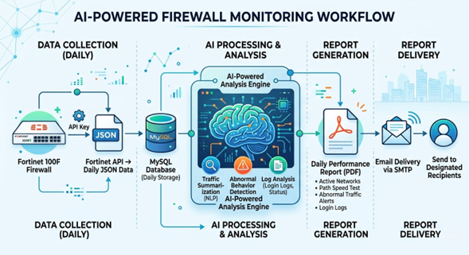

# 🛡️ AI-Powered Firewall Monitoring & Forensic Engine



An advanced, AI-driven monitoring system for FortiGate Firewalls that automates log collection, forensic analysis, and executive reporting. Leveraging local AI (Ollama) and high-frequency polling, this assistant provides real-time security insights directly to your inbox.

## 🚀 Key Features

- **🤖 AI-Driven Forensic Analysis**: Uses local LLMs (via Ollama) to analyze traffic patterns, detect security violations, and summarize administrative logins.
- **📊 Executive PDF Reporting**: Generates premium, executive-grade reports with detailed metrics, security alerts, and bandwidth performance.
- **🕒 Intelligent Scheduling**: High-frequency polling (1 min) for security events and low-frequency polling (30 min) for hardware health and system metrics.
- **🛡️ 5-Day Forensic Audit**: Automated deep-dive into authentication events with GeoIP lookups to identify suspicious access attempts.
- **📈 Dual-WAN Monitoring**: Real-time tracking of multiple ISP interfaces (Infonet, BSNL, etc.) with throughput statistics and status alerts.
- **⚡ Built-in Speed Test**: Automated bandwidth testing via Cloudflare CDN to monitor carrier performance.
- **📧 Automated Email Delivery**: Seamless integration with SMTP to deliver PDF reports directly to security administrators.

## 🛠️ Technology Stack

- **Core**: Python 3.x
- **Database**: SQLite (Persistent storage for logs and metrics)
- **AI Engine**: Ollama (phi3:latest)
- **Networking**: FortiOS REST API (v7.2.x tested)
- **Reporting**: FPDF for dynamic document generation
- **GeoIP**: ip-api.com for forensic location mapping

## 📋 Prerequisites

- **Python 3.10+**
- **Ollama**: Installed and running locally with the `phi3` model pulled (`ollama pull phi3`).
- **FortiGate Firewall**: API access enabled with a valid API Key.

## ⚙️ Configuration

Edit `config.py` with your environment details:

```python
# FortiGate API Settings
FGT_IP = "192.160.207.176:4449"
FGT_API_KEY = "your_api_key_here"

# AI Settings
OLLAMA_MODEL = "phi3:latest"
OLLAMA_URL = "http://localhost:11434/api/generate"

# SMTP Settings
SMTP_USER = "your_email@gmail.com"
SMTP_PASS = "your_app_password"
RECIPIENT_MAIL = "admin@example.com"
```

## 🚀 Installation & Usage

1. **Clone the repository**:
   ```bash
   git clone https://github.com/yourusername/firewall-asst.git
   cd firewall-asst
   ```

2. **Install dependencies**:
   ```bash
   pip install -r requirements.txt
   ```

3. **Run the monitor**:
   ```bash
   python main.py
   ```

## 📂 Project Structure

- `main.py`: The heart of the system—handles task scheduling and the main execution loop.
- `fgt_client.py`: Robust interface for communicating with the FortiGate REST API.
- `ai_manager.py`: Orchestrates communication with Ollama for log summarization and risk assessment.
- `report_manager.py`: Handles complex PDF layout, logic for policy change detection, and speed tests.
- `db_manager.py`: Manages the SQLite schema and ensures efficient data syncing from JSON logs.
- `mail_manager.py`: Handles secure SMTP communication for report delivery.
- `geo_scanner.py`: Performs IP geolocation lookups for forensic security audits.

## ⚠️ Disclaimer

*This tool is intended for professional cybersecurity monitoring. Ensure you have proper authorization before connecting to network infrastructure. All AI summaries are generated based on local statistical analysis and should be verified by a human analyst.*

**Developed for Private Use** | *Empowering Network Security with AI*
